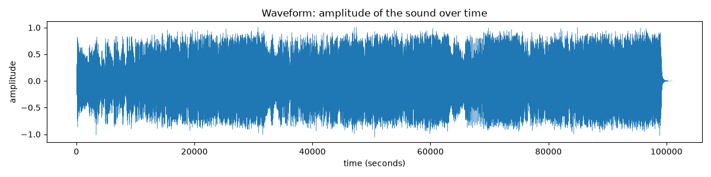
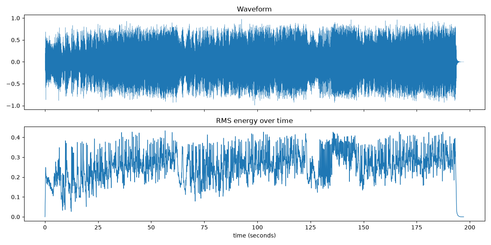
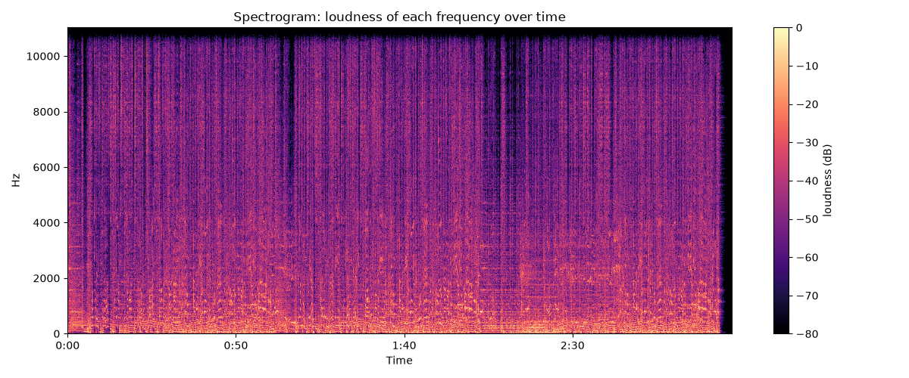
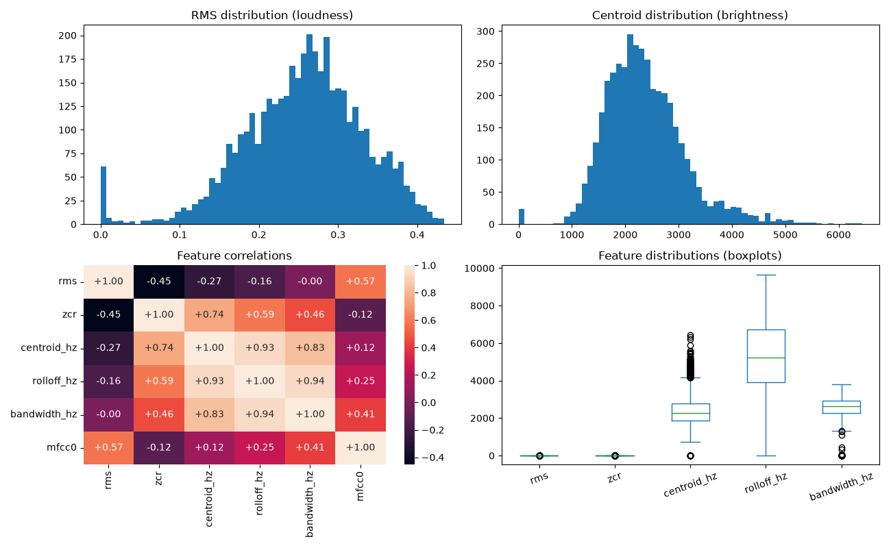

# SonicEDA

An educational project exploring what numerical data can be extracted from an MP3 audio file. Instead of treating a song as "music", this project treats it as a data source — a stream of raw samples that can be measured, transformed into meaningful features, and analyzed with standard data-science techniques.

## Overview

The starting question was simple: *what data lives inside an audio file, and how do we get it out?*

An MP3 on disk is compressed; loading it produces a long array of amplitude values — the raw samples. From there, the project progressively builds up:

- measure the signal (loudness, brightness, energy),
- analyze it in the frequency domain (spectrogram),
- extract musical features (tempo, beats, timbre, harmony),
- organize everything into a structured dataset,
- and run exploratory data analysis on that dataset.

The project deliberately stops at EDA. No machine-learning model was trained; the focus is understanding how audio becomes data.

## Analysis Pipeline

```
MP3
 │
 ▼
Raw audio samples (amplitude over time)
 │
 ▼
Signal measurements (RMS energy, zero-crossing rate)
 │
 ▼
Spectral / temporal analysis (spectrogram / STFT)
 │
 ▼
Audio feature extraction (tempo, spectral features, MFCCs, chroma)
 │
 ▼
Structured DataFrame (one row per ~46 ms of audio)
 │
 ▼
Exploratory Data Analysis (distributions, correlations, time profiles)
 │
 ▼
Observations
```

## Technologies

- **Python** — core language
- **Librosa** — audio loading, DSP, and feature extraction
- **NumPy** — numerical operations on sample arrays
- **Pandas** — structuring features into a DataFrame
- **Matplotlib** — waveform, envelope, and spectrogram plots
- **Seaborn** — correlation and distribution visualizations

## Project Structure

```
SonicEDA/
├── data/              # audio file (not committed to the repository)
├── plots/             # generated visualizations
├── src/               # all analysis scripts
│   ├── config.py              # shared constants (audio file, sample rate, frames)
│   ├── 01_metadata.py
│   ├── 02_waveform.py
│   ├── 02a_samplerate_compare.py
│   ├── 03_rms_energy.py
│   ├── 04_zero_crossings.py
│   ├── 05_spectrogram.py
│   ├── 06_features.py
│   ├── 06a_tempo.py       # focused per-feature stages
│   ├── 06b_spectral.py    #   (tempo, spectral, MFCC, chroma)
│   ├── 06c_mfcc.py
│   ├── 06d_chroma.py
│   └── 07_eda.py
└── requirements.txt
```

Each script is a standalone stage of the pipeline. The scripts share common
constants — the audio file path, sample rate, and frame settings — defined once
in `src/config.py`. Feature extraction is covered together in `06_features.py`,
with `06a`–`06d` providing more focused per-feature stages (tempo, spectral
features, MFCCs, chroma).

## Analysis

### 1. Waveform / raw samples

Loading the MP3 decodes it into ~4.3 million amplitude values at a sample rate of 22,050 Hz. A waveform plots these samples over time — the sound itself, drawn as a graph. This stage establishes what an audio file actually is as data: a list of numbers that are numerical representations of the audio waveform.



### 2. Sampling and sample rate

A second comparison loaded the same audio at 22,050 Hz and at its native 44,100 Hz. Due to the Nyquist limit, a sample rate can only represent frequencies up to half its value — 22,050 Hz covers up to 11,025 Hz, while 44,100 Hz covers up to 22,050 Hz, at roughly twice the number of samples. For the features explored in this project, 22,050 Hz was sufficient.

### 3. RMS energy

Raw samples alone are too fine-grained to summarize. RMS (root mean square) energy chops the audio into overlapping frames and produces one loudness value per frame — a smooth envelope showing how loud the song is at each moment.



### 4. Zero-crossing rate

Counting how often the waveform changes sign measures how frequently the signal alternates between positive and negative values. It can act as a rough indicator related to high-frequency content and noisiness/texture. Here the song crosses zero roughly 2,291 times per second.

### 5. Spectrogram / STFT

The Short-Time Fourier Transform (STFT) applies frequency analysis to each frame, producing a picture of *how loud each frequency is at each moment* — a spectrogram. This is the most information-dense visualization of the project, showing bass, harmonic detail, and musical structure all at once.



### 6. Feature extraction

From the spectral analysis, standard music-information features are extracted, grouped by what they capture:

- **Tempo and beats** — the pulse of the song and where each beat lands.
- **Spectral features** — centroid, rolloff, and bandwidth, describing how energy is distributed across frequencies.
- **MFCCs** — 13 coefficients describing timbre, the tonal "color" of the sound.
- **Chroma** — energy across the 12 pitch classes, capturing harmony and tonal emphasis.

Together, these features provide a compact numerical representation of different aspects of the song, including rhythm, spectral content, timbre, and pitch-class information.

### 7. Exploratory Data Analysis

All frame-level features are aligned into a single DataFrame — 4,246 rows (one per ~46 ms of audio) across 8 feature columns. Standard EDA follows: summary statistics, distributions, correlations, how features change across sections of the song, and per-second profiles.



## Extracted Features

| Feature | What it represents |
|---|---|
| **RMS energy** | Loudness envelope over time; how much signal energy each frame carries |
| **Zero-crossing rate** | How often the waveform changes sign; a rough indicator of high-frequency content and noisiness |
| **Spectral centroid** | "Center of mass" of the spectrum; perceived brightness |
| **Spectral rolloff** | Frequency below which ~85% of spectral energy sits; spectral shape |
| **Spectral bandwidth** | Spread of energy around the centroid; width of the spectrum |
| **MFCCs** | 13 coefficients describing timbre — the tonal "color" of the sound |
| **Chroma** | Energy in each of the 12 pitch classes; captures harmony and tonal emphasis |
| **Tempo / beats** | Beats per minute and the times at which beats occur |

## EDA Results

The analysis used `Pokemon.mp3` (197.25 seconds, loaded at 22,050 Hz, 4,246 frame-level rows).

**Tempo:** 143.6 BPM with 466 detected beats — a fast, energetic track.

**Spectral features:**

| Feature | Mean | Range |
|---|---|---|
| Spectral centroid | 2,362 Hz | 0 – 6,439 Hz |
| Spectral rolloff | 5,324 Hz | — |
| Spectral bandwidth | 2,589 Hz | — |

**Chroma:** the strongest average pitch classes were D (0.700), F (0.588), and G (0.580), indicating where the song's tonal energy concentrates.

**Key correlations between features:**

| Pair | Correlation |
|---|---|
| Rolloff ↔ Bandwidth | +0.937 |
| Centroid ↔ Rolloff | +0.927 |
| Centroid ↔ Bandwidth | +0.833 |
| ZCR ↔ Centroid | +0.745 |
| RMS ↔ MFCC0 | +0.571 |
| RMS ↔ ZCR | −0.454 |
| RMS ↔ Centroid | −0.266 |

The high positive correlations among centroid, rolloff, and bandwidth indicate they are strongly related spectral descriptors — they capture related but different aspects of the frequency distribution. The −0.454 RMS/ZCR correlation is a moderate inverse relationship in this particular recording: frames with greater RMS energy tended on average to have lower zero-crossing rates. This is an observation about this song, not a universal property of audio.

## Key Takeaways

The most important lesson is that audio is not a black box — it is a structured numerical signal. The pipeline that emerged was:

1. A song is a file, which decodes into an array of amplitude samples.
2. Those samples can be measured directly (loudness, crossings) and analyzed in the frequency domain (spectrogram).
3. Standard feature-extraction techniques compress the raw signal into a small set of meaningful numbers (tempo, brightness, timbre, harmony).
4. Once expressed as a DataFrame, audio becomes a dataset like any other — analysable with the same statistics, correlations, and visualizations used in data science.

The project also demonstrates the value of feature engineering: the "audio analysis" problem is really a problem of converting an unstructured signal into structured, comparable measurements.

## Future Improvements

These are possible extensions, not completed work:

- **Analyze a corpus of songs** instead of a single file, enabling cross-song comparison and genre-level observations.
- **Key and chord estimation** from the chroma features for automated music-theory analysis.
- **More robust beat tracking** on varying genres, and onset/segment detection for structural analysis (intro / verse / chorus).
- **Clustering or classification** using the extracted features (e.g. genre or mood) — a natural next step that would turn this into a machine-learning project.
- **A reusable module** wrapping the feature pipeline so the same analysis applies to any audio file.

## Project Classification

This project is primarily an **audio data analysis / Music Information Retrieval (MIR)** project, with connections to:

- Digital Signal Processing
- Data Science
- Exploratory Data Analysis
- Feature Engineering

## How to Run

1. **Create a virtual environment and install dependencies:**

   ```bash
   python -m venv .venv
   .venv\Scripts\activate
   pip install -r requirements.txt
   ```

2. **Place an audio file** in the `data/` directory:

   ```
   data/Pokemon.mp3
   ```

   The MP3 itself is not part of the repository, so any song can be used by dropping it in with this filename.

3. **Run the scripts in order** (each is a standalone stage):

   ```bash
   python src/01_metadata.py
   python src/02_waveform.py
   python src/02a_samplerate_compare.py
   python src/03_rms_energy.py
   python src/04_zero_crossings.py
   python src/05_spectrogram.py
   python src/06_features.py
   python src/07_eda.py
   ```

   Visualizations are written to the `plots/` directory.
